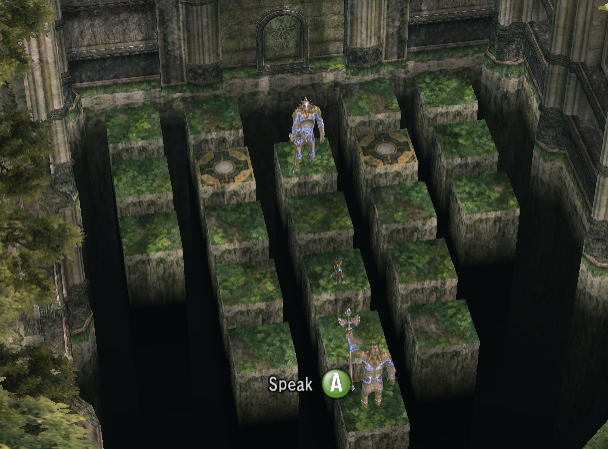
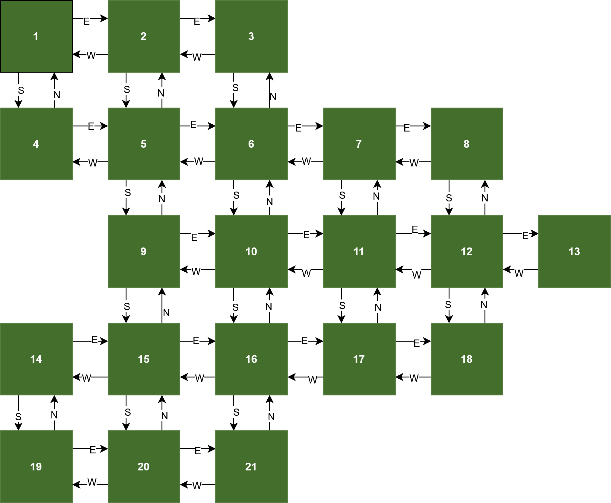

# Motivation

I was playing The Legend of Zelda, Twilight Princess when I finally reached the Sacred Grove. I was stunned by its visuals: I love old temples forgotten in forests. Some scenes further, and I am facing a Klotski-like puzzle. If you don't know what I am talking about, take a glance at these [TopicTech Gaming's "How To Solve The Sacred Grove Statue Puzzle" Youtube Shorts](https://youtu.be/eAhR_9qhY1M?si=L0XwBUh5HOgOjiOh). Basically we need to move a pair of statues to their 'original' tiles given that one of them mirror our movement (i.e., we go up, it goes down) and the other follows us exactly (like a shadow). Below we have an image of the puzzle at its starting place:

Notice the character's original position is such that:
- Wolf Link is on the 11-th node
- Shadow Statue is on the 13-th node
- Mirror Statue is on the 9-th node

And that the goal is to place the statues at nodes 5 and 15.

# First Version: Random Walk

Given the puzzle's structure I noticed at once the movements can be modeled like a graph, so I can give the 'search' a structure: searching in a graph is a known-problem! If each tile is a node, the movements can be seen as directed edges. Moreover, I can control the mirror statue movement by assigning labels to the movements (North, South, East, and West) and flipping it before I move the guardian. The shadow statue follows the original, non-flipped label. This led to [an encoded graph structure](./puzzle_graph.py) based on the following Figure:
 

I coded the rules for each statue and link movement on the [search.py](./search.py) file, while [moving_character.py](./moving_character.py) define the place update logic. As far as I understood, these are few and simple:
- Wolk Link can only move to empty tiles;
- If Wolk Link's movement makes the statue go to a non-existent tile, the guardian stays in place;

To random-walk, given any Wolf Link position, I randomly sample the next one and that is it. What I noticed, then, is that link simply meanders, and the steps limit is quickly reached. I considered guiding this process by a simple metric: how far are the guardians to their final tiles. Since I don't know which guardian (shadow or mirror) is meant to which tile (5 or 15), I thought that I would need to have two 'search fronts: one placing the shadow statue on 5, and the other placing it on 15.

But before I could further explore this solution, I recalled [2swap's impressive "I Solved Klotski" Youtube video](https://youtu.be/YGLNyHd2w10?si=j5js-7674QHDwXiC) I watched months prior. It beautifully explains how we can map a state-based problem into a graph where each node is a state and the edges are single-changes that move from a state to another. A last thought I've got on this version was: should I apply a more robust method for the random walk? Markov Chains maybe? Idk... never even tried tho.

# Second Version: Brute Force State Graph Generation

At this point I thought: why not just generating the full-fledged state graph? Would it have an infinite number of nodes? Well. link can only move to a finite number of tiles ($21 - 2 = 19$), so even though it can be a large number of nodes, it won't be infinite. But how many nodes would we arrive? Well, as an absolute upper limit, notice that, in a 21-tile puzzle, we can arbitrarily choose 3 to place Wolf Link and the statues at. There are $C_{3}^{21}$ combinations of 3-tiles out of a universe of 21. Moreover, for any three tiles, we can permute the 3 characters $3!$ times, leaving us with

$C_{3}^{21} \cdot 3! = \binom{21}{3} \cdot 3! = \frac{21!}{(21-3)!\cdot 3!} \cdot 3! = \frac{21!}{(21-3)!} = 21 \cdot 20 \cdot 19  = 20 \cdot (20+1)(20-1) = 20\cdot(20^2 - 1^2) = 20^3 - 20 = 7980 $

possible states. Naturally, some of these states might not be reached at all, but at least we've got an upper limit.

Ok, moving to the State Graph generation, we've got a rather simple task to code: keep a stack with every state to be visited (a state is determined by Wolf Link and the Statue's position). When visiting a state, generate the next ones by estimating all possible movements from it and put it back on the stack. If the stack is empty, then our job is done!

> It took me some time to actually figure out how procedurally generate all states. More specifically, I wasn't sure which rule to use to 'stop generating'. Luckily I remembered the good-old stack-based algorithms (like flood fill) that keep a stack to 'remember' what to do next.

The graph generation is implemented at an [homonymous python file](./state_graph_generation.py). It is used in the [main.py](./main.py) to generate the [state-graph.graphml](./state-graph.graphml). With the graph created, all we need to do is [find a way to place the statues in the right position](./find_solutions.py).

## Last thoughts on the State Graph:
- I'd love to visualize the graph using swaptube. Gotta do it on the future;
- The absolute upper limit for graph states are 7980 elements. The generation found something around the half of it: 3398 nodes. We've got 8950 edges;
- There are 24 'solution states': half of it place the mirror statue on the tile number 5, and the other placing it on 15.